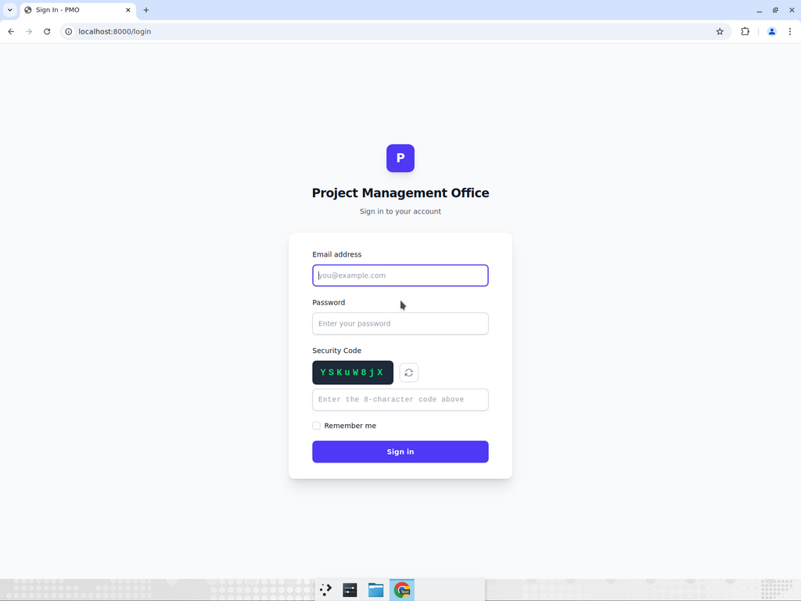
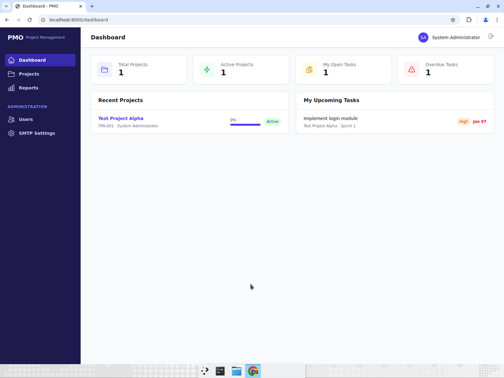
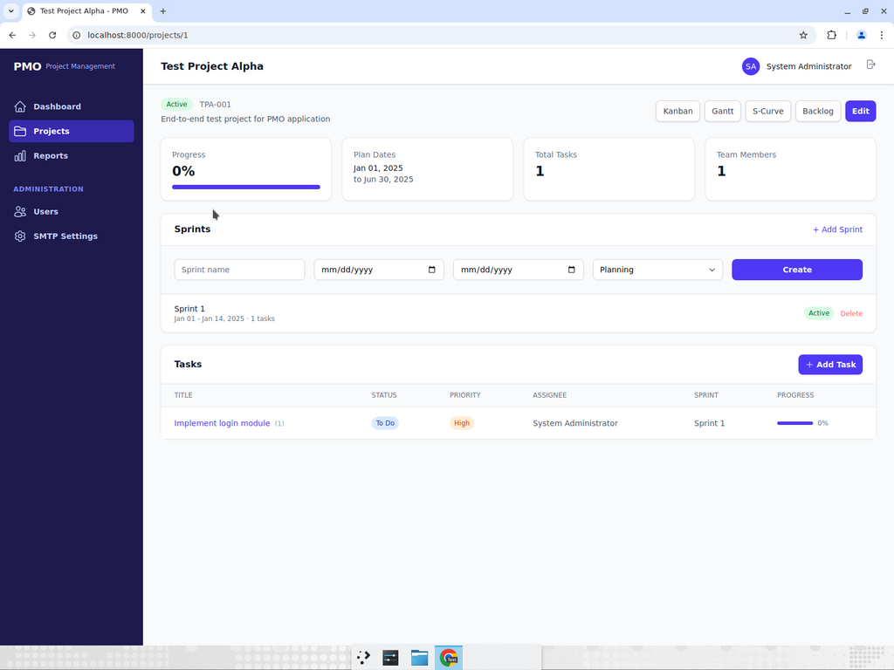
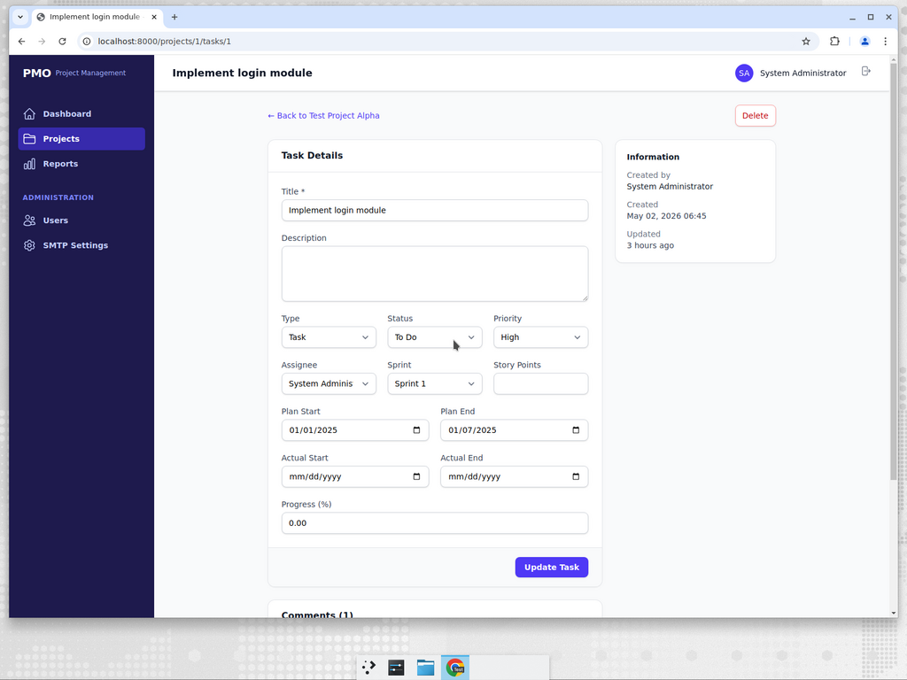
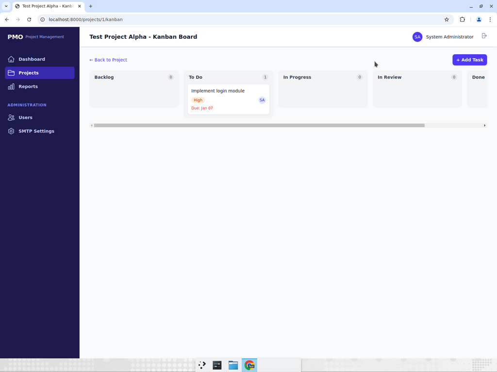
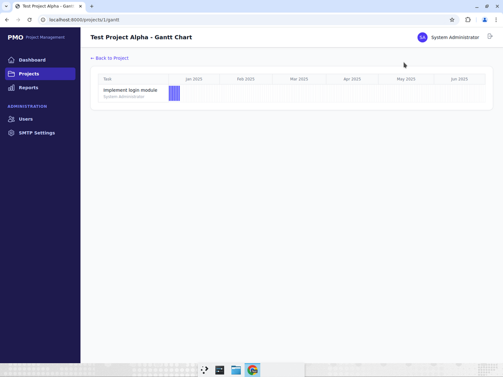
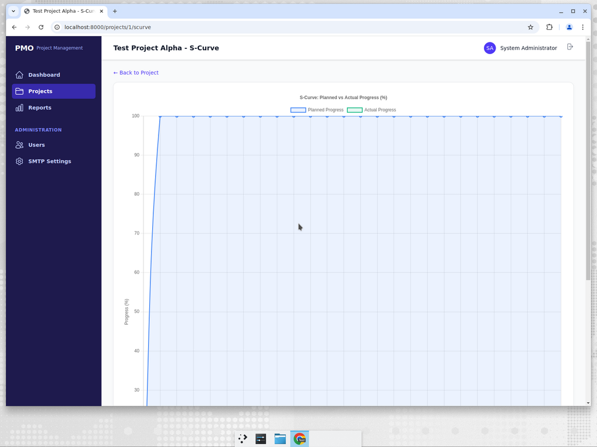
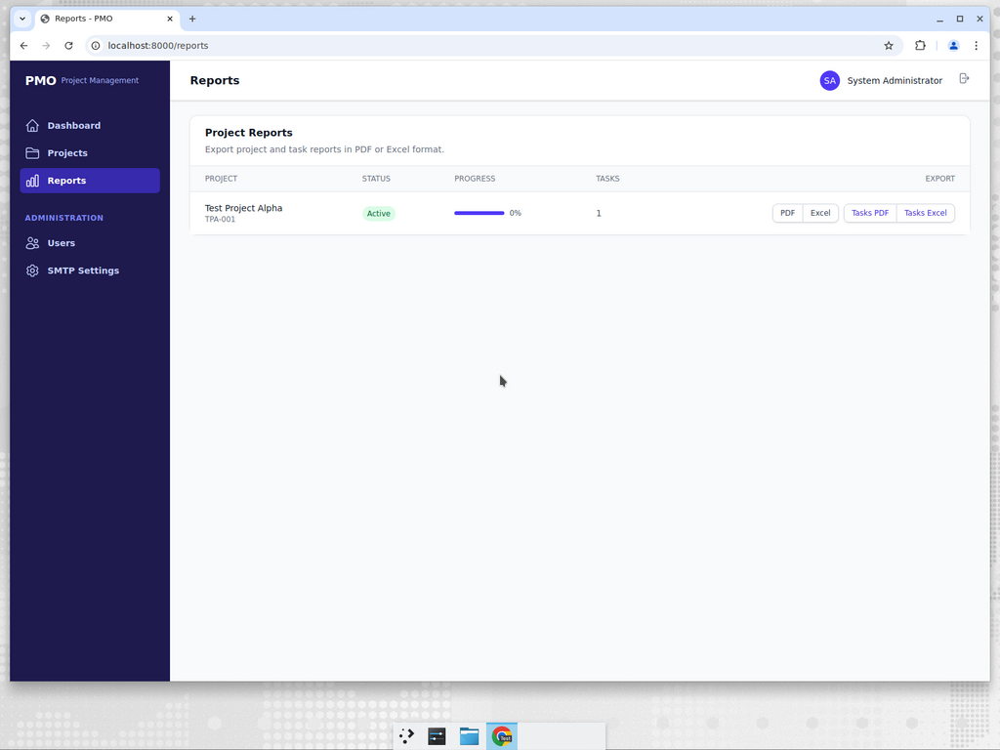
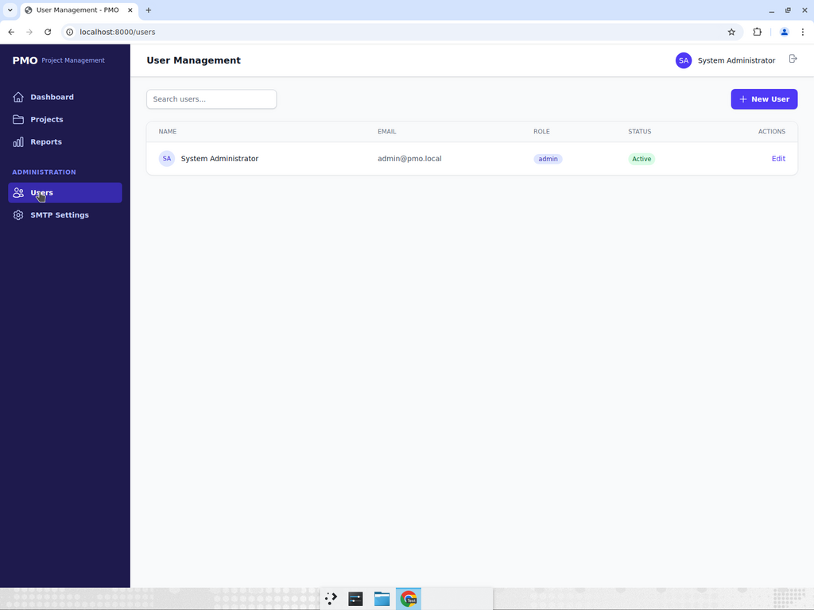
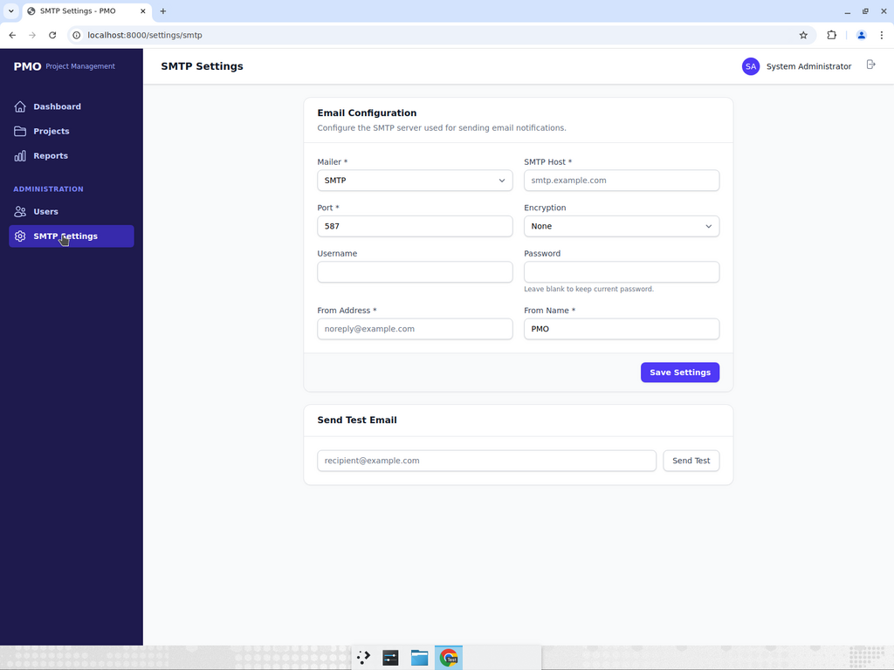

# PMO - Project Management Office

A comprehensive, secure, and elegant web-based project management application built with **Laravel 12**. Designed for teams of any size to plan, track, and deliver projects efficiently with agile methodologies.


---

## Screenshots

### Login Page
Secure login with 8-character alphanumeric CAPTCHA (mixed case, refreshable, 5-minute expiry).



### Dashboard
Overview of all projects with stats cards (Total Projects, Active Projects, Open Tasks, Overdue Tasks), recent projects with progress bars, and upcoming task deadlines.



### Project Detail
Full project overview with plan dates, progress tracking, sprint management, and task list. Quick access buttons to Kanban, Gantt, S-Curve, and Backlog views.



### Task Management
Complete task lifecycle management with title, type (Epic/Story/Task/Bug/Sub-task), status, priority, assignee, sprint assignment, plan/actual dates, progress tracking, and team comments.



### Kanban Board
Drag-and-drop task board with 5 status columns: Backlog, To Do, In Progress, In Review, and Done. Each card shows priority badge, assignee avatar, and due date.



### Gantt Chart
Monthly timeline visualization showing task bars across the project duration. Each task displays its assignee and spans its planned date range.



### S-Curve Chart
Planned vs Actual progress comparison chart with stat cards showing planned progress, actual progress, and deviation percentage.



### Reports & Export
Export project summaries and task lists in PDF or Excel format. Professional report formatting with project details, status, and progress.



### User Management
Role-based user management with Admin, Manager, Member, and Viewer roles. Search, create, edit, activate/deactivate users.



### SMTP Settings
Admin-configurable SMTP email settings with test email functionality. Supports SMTP, Sendmail, and Log mailers with TLS/SSL encryption.



---

## Features

### Project Management
- **Project CRUD** with plan/actual start and end dates, budget tracking, and progress monitoring
- **Sprint Management** for agile workflows with planning, active, and completed states
- **Kanban Board** with drag-and-drop task cards using SortableJS
- **Gantt Chart** for visual timeline and task scheduling (monthly columns)
- **S-Curve** for planned vs. actual progress comparison using Chart.js
- **Backlog Management** for unscheduled tasks

### Task Management
- Full task lifecycle: Backlog → To Do → In Progress → In Review → Done
- Task types: Epic, Story, Task, Bug, Sub-task
- Priority levels: Low, Medium, High, Critical
- Story points, assignee management, and parent/child task relationships
- **Task Comments** for team collaboration with author and timestamp
- Automatic progress calculation and propagation

### User & Role Management (RBAC)
- Built-in roles: Admin, Manager, Member, Viewer (powered by [Spatie Laravel Permission](https://github.com/spatie/laravel-permission))
- Permission-based access control throughout the application
- User activation/deactivation
- Strong password policy (12+ chars, mixed case, numbers, symbols, HIBP check)

### Security (OWASP / SecurityHeaders / Qualys A+ Grade)
- **8-character alphanumeric CAPTCHA** on login (mixed case, time-limited, refreshable)
- **Content Security Policy (CSP)** with nonce-based script/style allowlisting
- **Strict-Transport-Security (HSTS)** with preload directive
- **X-Content-Type-Options**, **X-Frame-Options**, **Referrer-Policy**
- **Permissions-Policy** restricting camera, microphone, geolocation, etc.
- **Cross-Origin policies** (COOP, CORP, COEP)
- **Rate limiting** on login attempts (5 per 5 minutes)
- **CSRF protection** on all forms
- **Session encryption** and regeneration on login
- **SQL injection prevention** via Eloquent ORM parameterized queries
- **XSS prevention** via Blade auto-escaping and HTML tag allowlisting
- **SMTP password encryption** using Laravel's built-in encryption
- Server header removal (X-Powered-By, Server)

### Reporting & Export
- **PDF Export** for project summaries and task lists (via [DomPDF](https://github.com/barryvdh/laravel-dompdf))
- **Excel Export** for project and task data (via [Maatwebsite Excel](https://github.com/SpartnerNL/Laravel-Excel))
- Professional report formatting with company branding
- 4 export types per project: Project PDF, Project Excel, Tasks PDF, Tasks Excel

### Email Notifications
- **SMTP Settings** configurable via admin panel (no .env editing required)
- **Test email** functionality to verify configuration
- Automatic notifications for task assignments
- SMTP password stored encrypted in database

### User Interface
- Modern, responsive design with **Tailwind CSS**
- Clean sidebar navigation with active state indicators
- Interactive charts and data visualizations using **Chart.js**
- Mobile-friendly layout
- **Alpine.js** for lightweight interactivity
- Auto-dismissing success/error notifications
- User initials avatars throughout the application

---

## Requirements

- **PHP** >= 8.2 with extensions: BCMath, Ctype, cURL, DOM, Fileinfo, GD, Intl, JSON, Mbstring, OpenSSL, PDO, Tokenizer, XML, Zip, Sodium
- **Composer** >= 2.0
- **Node.js** >= 18.x and **npm** >= 9.x
- **Database** (one of):
  - MySQL 8.0+
  - MariaDB 10.3+
  - PostgreSQL 13+
  - Microsoft SQL Server 2019+
  - Oracle 12c+
  - SQLite 3.35+ (for development/testing)

---

## Installation

### 1. Clone the Repository

```bash
git clone https://github.com/msalmanfarisi/pmo.git
cd pmo
```

### 2. Install PHP Dependencies

```bash
composer install --optimize-autoloader --no-dev
```

### 3. Install Node.js Dependencies and Build Assets

```bash
npm install
npm run build
```

### 4. Environment Configuration

```bash
cp .env.example .env
php artisan key:generate
```

Edit `.env` and configure your database connection:

```env
# For MySQL/MariaDB
DB_CONNECTION=mysql
DB_HOST=127.0.0.1
DB_PORT=3306
DB_DATABASE=pmo
DB_USERNAME=your_username
DB_PASSWORD=your_password

# For PostgreSQL
DB_CONNECTION=pgsql
DB_HOST=127.0.0.1
DB_PORT=5432
DB_DATABASE=pmo
DB_USERNAME=your_username
DB_PASSWORD=your_password

# For SQL Server
DB_CONNECTION=sqlsrv
DB_HOST=127.0.0.1
DB_PORT=1433
DB_DATABASE=pmo
DB_USERNAME=your_username
DB_PASSWORD=your_password

# For SQLite (development)
DB_CONNECTION=sqlite
DB_DATABASE=/absolute/path/to/database.sqlite
```

### 5. Run Migrations and Seed

```bash
php artisan migrate
php artisan db:seed
```

This creates the default admin user and roles (Admin, Manager, Member, Viewer).

### 6. Set Permissions (Linux/macOS)

```bash
chmod -R 775 storage bootstrap/cache
chown -R www-data:www-data storage bootstrap/cache
```

### 7. Start the Application

```bash
# Development
php artisan serve

# The application will be available at http://localhost:8000
```

---

## Default Login Credentials

| Email | Password | Role |
|-------|----------|------|
| `admin@pmo.local` | `Admin@PMO2024!` | Administrator |

> **Important:** Change the default admin password immediately after first login.

---

## Configuration

### SMTP Email Settings

SMTP can be configured in two ways:

1. **Via Admin Panel** (recommended): Navigate to **SMTP Settings** in the sidebar under Administration
2. **Via `.env` file**:

```env
MAIL_MAILER=smtp
MAIL_HOST=smtp.example.com
MAIL_PORT=587
MAIL_USERNAME=your_email@example.com
MAIL_PASSWORD=your_password
MAIL_ENCRYPTION=tls
MAIL_FROM_ADDRESS=noreply@example.com
MAIL_FROM_NAME="PMO"
```

### Database Compatibility

This application uses **Eloquent ORM** exclusively, ensuring compatibility across all Laravel-supported databases:
- All queries use Eloquent query builder (no raw SQL)
- Migrations use database-agnostic schema builder
- No database-specific functions or syntax
- Tested with SQLite for development; production-ready with MySQL, PostgreSQL, SQL Server, or Oracle

### Security Headers

The application automatically sets the following security headers via the `SecurityHeaders` middleware:

| Header | Value |
|--------|-------|
| Strict-Transport-Security | `max-age=31536000; includeSubDomains; preload` |
| Content-Security-Policy | Nonce-based script/style; `frame-ancestors 'none'` |
| X-Content-Type-Options | `nosniff` |
| X-Frame-Options | `DENY` |
| X-XSS-Protection | `0` (deprecated, correctly disabled) |
| Referrer-Policy | `strict-origin-when-cross-origin` |
| Permissions-Policy | `camera=(), microphone=(), geolocation=(), payment=()...` |
| Cross-Origin-Opener-Policy | `same-origin` |
| Cross-Origin-Resource-Policy | `same-origin` |

> **Production Note:** To achieve a full A+ grade on SecurityHeaders.com, also set `expose_php = Off` in your `php.ini` and add `fastcgi_hide_header X-Powered-By;` to your Nginx configuration.

### Queue Workers (Optional)

For sending email notifications asynchronously:

```bash
php artisan queue:work --tries=3 --timeout=60
```

---

## Production Deployment

### Nginx Configuration Example

```nginx
server {
    listen 443 ssl http2;
    server_name pmo.yourdomain.com;
    root /var/www/pmo/public;
    index index.php;

    ssl_certificate /etc/ssl/certs/yourdomain.crt;
    ssl_certificate_key /etc/ssl/private/yourdomain.key;

    # Remove server tokens
    server_tokens off;

    location / {
        try_files $uri $uri/ /index.php?$query_string;
    }

    location ~ \.php$ {
        fastcgi_pass unix:/var/run/php/php8.3-fpm.sock;
        fastcgi_param SCRIPT_FILENAME $realpath_root$fastcgi_script_name;
        include fastcgi_params;
        fastcgi_hide_header X-Powered-By;
    }

    location ~ /\.(?!well-known).* {
        deny all;
    }
}
```

### Optimization

```bash
php artisan config:cache
php artisan route:cache
php artisan view:cache
php artisan event:cache
composer install --optimize-autoloader --no-dev
```

---

## Project Structure

```
app/
├── Exports/           # Excel export classes (ProjectReportExport, TaskReportExport)
├── Http/
│   ├── Controllers/   # Request handlers
│   │   └── Auth/      # LoginController with CAPTCHA
│   └── Middleware/     # SecurityHeaders, RateLimitLogin
├── Models/            # Eloquent models (Project, Sprint, Task, TaskComment, User, etc.)
├── Notifications/     # Email notification classes (TaskAssigned)
└── Services/          # Business logic (CaptchaService, ActivityLogService)

database/
├── migrations/        # Database schema (users, projects, sprints, tasks, comments, etc.)
└── seeders/           # Default data (roles, permissions, admin user)

resources/
├── css/              # Tailwind CSS entry point
├── js/               # Alpine.js, SortableJS, Chart.js
└── views/            # Blade templates
    ├── auth/          # Login page with CAPTCHA
    ├── layouts/       # App layout with sidebar navigation
    ├── projects/      # Project views (index, show, edit, Kanban, Gantt, S-Curve, Backlog)
    ├── tasks/         # Task views (create, show/edit with comments)
    ├── users/         # User management (index, create, edit)
    ├── settings/      # SMTP settings panel
    └── reports/       # PDF templates, report index with export buttons

docs/
└── screenshots/       # Application screenshots for documentation
```

---

## Technology Stack

| Component | Technology |
|-----------|-----------|
| Backend Framework | Laravel 12 |
| PHP Version | 8.2+ |
| ORM | Eloquent (multi-database compatible) |
| Frontend CSS | Tailwind CSS |
| Frontend JS | Alpine.js |
| Charts | Chart.js |
| Drag & Drop | SortableJS |
| PDF Export | DomPDF |
| Excel Export | Maatwebsite Excel |
| RBAC | Spatie Laravel Permission |
| Build Tool | Vite |

---

## Quick Start Guide

1. **Clone & Install:**
   ```bash
   git clone https://github.com/msalmanfarisi/pmo.git
   cd pmo
   composer install
   npm install && npm run build
   ```

2. **Configure & Migrate:**
   ```bash
   cp .env.example .env
   php artisan key:generate
   # Edit .env with your database settings
   php artisan migrate --seed
   ```

3. **Run:**
   ```bash
   php artisan serve
   # Open http://localhost:8000
   # Login: admin@pmo.local / Admin@PMO2024!
   ```

4. **Start Managing Projects:**
   - Create a new project with plan dates
   - Add sprints for agile iterations
   - Create and assign tasks to team members
   - Track progress via Kanban, Gantt, and S-Curve views
   - Export reports in PDF or Excel format

---

## License

This project is open-sourced software licensed under the [MIT License](LICENSE).
